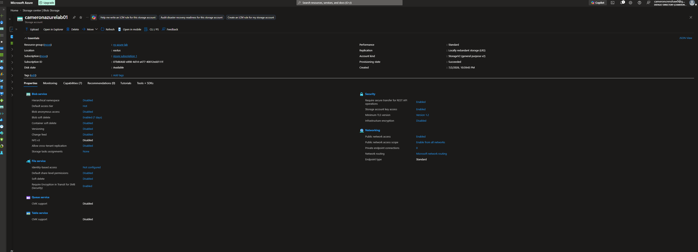
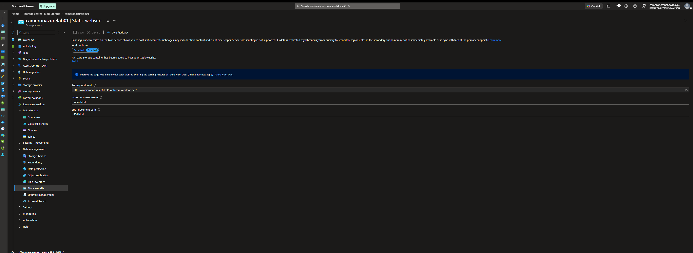
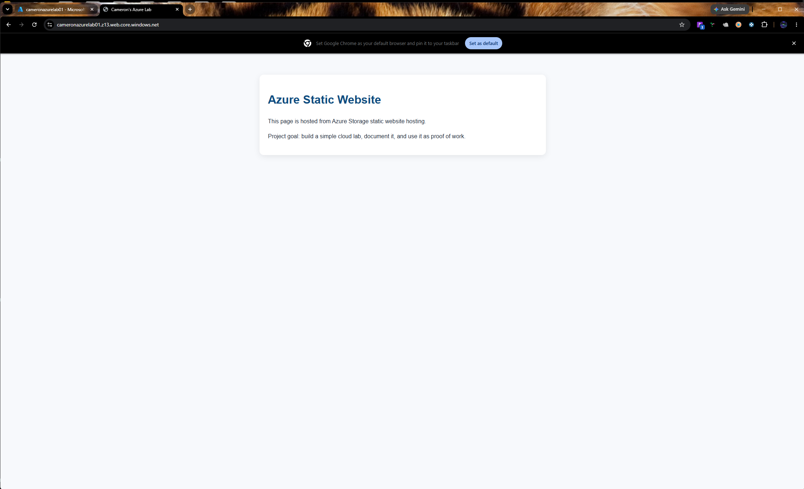

# Azure Static Site Lab

## Project Summary
This project demonstrates a basic Azure Storage static website. I used it to practice cloud deployment, cost awareness, and simple project documentation.

## Live Site
https://cameronazurelab01.z13.web.core.windows.net/

## What I Built
- Created an Azure Storage account
- Enabled static website hosting
- Uploaded `index.html` and `404.html`
- Verified the site through the public endpoint

## Why I Built It
The goal was to get hands-on experience with Azure storage and static website hosting while keeping the project small, practical, and low cost.

## What I Learned
- How to create and configure an Azure Storage account
- How to enable static website hosting
- How to upload and serve files from the `$web` container
- How to test a live Azure endpoint
- How to document a cloud project clearly

## Screenshots

## Files
- `index.html`
- `404.html`
- `README.md`
